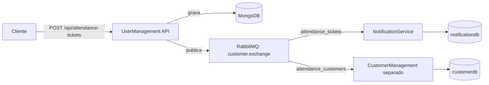

# Customer Services

Demo de atendimento por senhas com três serviços em .NET 10. A API gera senhas normais ou prioritárias; RabbitMQ distribui cada nova senha para os serviços de notificação e atendimento.

## Estrutura e responsabilidades

| Diretório | Responsabilidade | Persistência |
| --- | --- | --- |
| `UserManagementService/` | API de geração e chamada de senhas; inclui uma UI Blazor WebAssembly | MongoDB (replica set `rs0`) |
| `NotificationService/` | Worker que consome senhas e mantém uma lista de espera | PostgreSQL (`notificationdb`) |
| `CustomerManagementService/` | Consumidor de senhas e API para chamar a próxima; inclui um AppHost Aspire | PostgreSQL (`customerdb`) |

Cada solução separa entidades e contratos em `Domain`, regras e casos de uso em `Application` (ou `Service`, no CustomerManagement), integrações em `Infrastructure`/`Infra` e endpoints em `Api`/`App`. Os projetos de teste ficam em `tests/`. O arquivo `compose.yaml` inicia a infraestrutura, UserManagement e NotificationService; **CustomerManagement e a UI não fazem parte do Compose**.

## Fluxo de uma senha



`GET /api/attendance-queue/next` chama a próxima senha no MongoDB, priorizando senhas prioritárias. No CustomerManagement, `GET /customers/next` seleciona a próxima senha em espera no banco próprio e a marca como chamada. NotificationService registra as senhas recebidas e a quantidade em espera; o envio de mensagens ao usuário ainda não está implementado.

## Executar com Docker

Pré-requisitos: Docker com Compose e, para compilar ou testar fora dos contêineres, SDK .NET 10. Na raiz do repositório:

```bash
docker compose up --build -d
docker compose ps
```

Aguarde `mongo-init` concluir a configuração do replica set antes de gerar senhas (`docker compose logs mongo-init`). A primeira chamada pode levar alguns instantes enquanto as dependências iniciam.

| Serviço | Acesso local |
| --- | --- |
| UserManagement API e Swagger (ambiente Development) | `http://localhost:8080/swagger` |
| NotificationService (documento OpenAPI) | `http://localhost:8081/openapi/v1.json` |
| RabbitMQ Management | `http://localhost:15672` (`admin` / `adminpassword`) |
| MongoDB / PostgreSQL / RabbitMQ AMQP | `27017` / `5432` / `5672` |

Exemplos de uso da API:

```bash
curl -X POST 'http://localhost:8080/api/attendance-tickets?type=Normal'
curl -X POST 'http://localhost:8080/api/attendance-tickets?type=Priority'
curl 'http://localhost:8080/api/attendance-queue/next'
```

Para acompanhar o processamento, use `docker compose logs -f user-management-service notification-service`. Encerre com `docker compose down`; acrescente `-v` somente se quiser apagar os dados locais.

## Compilar e testar

```bash
dotnet build UserManagementService/UserManagementService.sln
dotnet build NotificationService/NotificationService.sln
dotnet build CustomerManagementService/CustomerManagementService.sln
dotnet test UserManagementService/UserManagementService.sln
dotnet test NotificationService/NotificationService.sln
```

Os testes existentes usam xUnit. CustomerManagement ainda não possui projeto de testes; o teste de NotificationService é apenas um marcador e não cobre o consumo de mensagens.

## Executar componentes separados

CustomerManagement pode ser iniciado pelo projeto `CustomerManagementService/src/CustomerManagementAppHost`, mas requer `customerdb` criado e migrado e conexões `customer_db` e `customer_broker` configuradas para o PostgreSQL e RabbitMQ usados. Os valores atuais de `CustomerManagementApp/appsettings.json` não correspondem às portas e credenciais do Compose.

A UI em `UserManagementService/src/UserManagement.UI` também é separada. Sua página de senha ainda chama `/api/attendance/generate-ticket`, enquanto a rota atual da API é `/api/attendance-tickets`; além disso, `ApiBaseUrl` aponta para a API local na porta 7164. Ajuste ambos antes de usá-la com o Compose. As credenciais do Compose são somente para desenvolvimento: configure segredos por ambiente em outros cenários.
